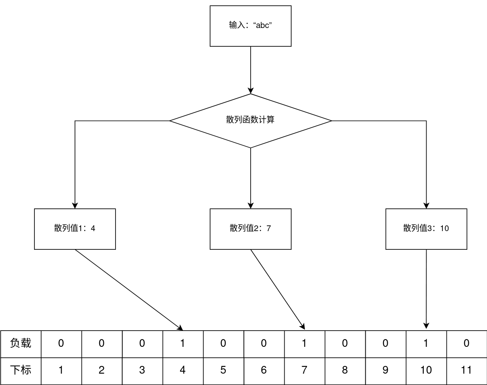

# 布隆过滤器

---

## 原理

---

### 简介

布隆过滤器是一个用于在容忍一定误报率的情况下以$O(1)$的复杂度存取元素的数据结构。同样以$O(1)$的复杂度存取元素的数据结构还有哈希表（散列表），不过在碰撞较多的情况下，哈希表可能退化到$O(n)$的时间复杂度。布隆过滤器则将该复杂度转嫁到误报率上，这在稍后的原理解释部分会展开

### 工作原理

布隆过滤器使用一个位数组（大小记为$m$）作为负载。布隆过滤器首先选取$k$个散列函数，对输入分别应用这$k$个散列函数得到$k$个散列值，再在负载中将这$k$个散列值对应下标处的位记为$1$。

例如，对于输入`"abc"`，假如我们采用$3$个散列函数，分别计算得到$4$、$7$、$10$，则将这三个下标处位数组的值记为$1$。在检验`"abc"`是否存在时，只需重复一遍该计算过程，得到同样的散列值，如果位数组对应位均为$1$，我们称`"abc"`**可能存在**于该过滤器中，反之则**一定不存在**。

误报率的产生就在于此。注意到这里散列值的计算可能存在重复（对于不同输入，同一个散列函数得到的值不会重复，但是不同散列函数之间就不一定了），假设有另一输入`"def"`计算得到散列值为$7$、$11$、$13$，这个时候过滤器中下标为$4$、$7$、$10$、$11$、$13$的位均为1。若有一个输入`"ghi"`计算得到的散列值恰好为$10$、$11$、$13$，过滤器会声称该输入存在于其中，但这实际上是误报。因此过滤器给出的阳性结果可能是假阳性（fake positive），这也解释了上文的“可能存在”中“可能”的含义。

为什么没有假阴性？存在假阴性的必要前提是已经处理的输入中，有某个已经计算得到的散列值对应到位数组中的值实际为$0$，而这是不可能的（除非有越界访问的其他程序把这一位改成了$0$，这显然不在布隆过滤器讨论的范围之内）。

### 过滤器大小和散列函数数量的选择

给定输入规模$n$、可接受的误报率$p$，可以得到过滤器负载大小$m$和散列函数数量$k$如下：

$$
\begin{cases}
m = -\frac{n \ln p}{(\ln 2)^2} \\
k = \frac{m}{n} \ln 2
\end{cases}
$$

下面我们来证明。首先，经过$k$个散列函数的计算，某一位依然未被置为$1$的概率为

$$
P(bit[i] = 0) = (1 - \frac{1}{m}) ^ k,  i = 0, 1, ..., m-1
$$

上式是插入一次元素的结果。待插入$n$个元素后，该位依然为$0$的概率为

$$
\begin{aligned}
P(bit[i] = 0) &= (1 - \frac{1}{m}) ^ {nk} \\
&= ((1 - \frac{1}{m}) ^ m) ^ {\frac{nk}{m}} \\
&\approx e^{-\frac{nk}{m}}
\end{aligned}
$$

要产生误报，需要该输入计算得到的$k$个散列值对应的位均为$1$。那么，我们可以计算得到误报率：

$$
\begin{aligned}
p &= (1 - e ^ {-\frac{nk}{m}}) ^ k
\end{aligned}
$$

接下来计算散列函数数量$k$。此时我们不关注$m$和$n$，将其固定，误报率变为一个关于$k$的函数：

$$
\begin{aligned}
p(k) &= (1 - e ^ {-\frac{nk}{m}}) ^ k
\end{aligned}
$$

两边同时取对数，方便计算：

$$
\begin{aligned}
\ln p(k) &= k\ln (1 - e ^ {-\frac{nk}{m}})
\end{aligned}
$$

对$k$求导：

$$
\begin{aligned}
\frac{d\ln p(k)}{dk} &= ln(1 - e^{-\frac{nk}{m}}) + k \frac{\frac{n}{m}e^{-\frac{nk}{m}}}{1-e^{-\frac{nk}{m}}}
\end{aligned}
$$

令该导数为$0$，具体计算过程略，解得

$$
\boxed{
k = \frac{m}{n} \ln2
}
$$

前面我们还得到

$$
\begin{aligned}
P(bit[i] = 0) &= e ^ {-\frac{nk}{m}} \\
&= e ^ {-\ln2} \\
&= \frac{1}{2}
\end{aligned}
$$

也就是在最优参数下，每一位为$0$和为$1$的概率均为$\frac{1}{2}$，即位数组中有一半位为$0$、一半位为$1$。

再次代入误报率，得到

$$
\begin{aligned}
p &= (1 - e ^ {-\frac{nk}{m}}) ^ k \\
&= (\frac{1}{2}) ^ k \\
&= (\frac{1}{2}) ^ {\frac{m}{n}\ln2}
\end{aligned}
$$

据此，有

$$
\boxed{
\begin{aligned}
m = -\frac{n\ln p}{(\ln 2) ^ 2}
\end{aligned}
}
$$

### Counting Bloom Filter

普通的布隆过滤器不支持删除、只支持插入。如果我们不使用位数组，而是使用更多的空间来将原来的位扩展为一个计数器，我们就不仅可以支持插入，还可以支持删除。这就是计数布隆过滤器（Counting Bloom Filter）的基本原理。

这里counter的大小也值得权衡，本文暂时不作进一步推导，而是给出如下结论：一个counter的值大于等于$16$的概率约为$1.37 \times 10^{-15} \times m$，其中$m$是counter数组的大小。也就是说，一般而言$4$位的counter就足够了（此时该过滤器的空间占用已经达到了普通布隆过滤器的$4$倍）。

---

## 参考文献

---

- https://zhuanlan.zhihu.com/p/43263751
- https://cloud.tencent.com/developer/article/1136056
- https://zh.wikipedia.org/wiki/%E6%95%A3%E5%88%97%E5%87%BD%E6%95%B8